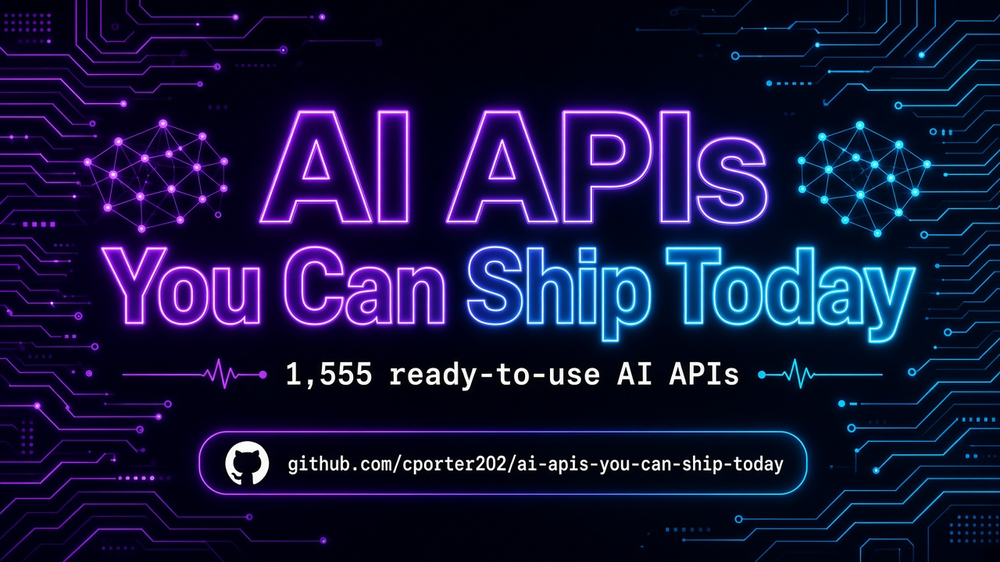

 
 

  <a href="#at-a-glance"><strong>At A Glance</strong></a>
  |
  <a href="#start-here"><strong>Start Here</strong></a>
  |
  <a href="#explore-the-stack"><strong>Explore The Stack</strong></a>
  |
  <a href="#why-this-repo-wins"><strong>Why This Repo Wins</strong></a>
  |
  <a href="#star-history"><strong>Star History</strong></a>

### 🚀 Join My Skool Community

**Want to learn how to vibe code like the pros? Join my Skool community! 🎯**

*I'll show you how to set up applications to use these APIs and start making money! I have the best tech stack when it comes to vibe coding that virtually costs nothing. Forget tools like Loveable, Replit, Manus, Base44, etc.*

 

  <a href="https://www.skool.com/vibe-coding-with-chris-7196" target="_blank" style="display: inline-block; background: #667eea; background-image: linear-gradient(135deg, #667eea 0%, #764ba2 100%); color: #ffffff !important; text-decoration: none !important; padding: 18px 45px; font-size: 18px; font-weight: bold; border-radius: 35px; box-shadow: 0 8px 25px rgba(102, 126, 234, 0.5); letter-spacing: 1px; text-transform: uppercase; border: 2px solid rgba(255, 255, 255, 0.3); cursor: pointer; font-family: -apple-system, BlinkMacSystemFont, 'Segoe UI', Helvetica, Arial, sans-serif;">
    🚀 Join Vibe Coding Community →
  </a>

## At A Glance

> The ultimate collection of shippable AI APIs — LLMs, vision, agents, and MCP servers ready for production products. **1,555 production-ready APIs** across **5 navigable sections**.

This repository is designed to feel like a launchpad, not a junk drawer. Pick a section folder, scan the API table, and click through to the provider — no endless flat scrolling.

| Metric | Count |
|--------|-------|
| Total APIs | 1,555 |
| Categories | 5 |
| Last Updated | 2026-09-16 |
| Focus | AI Product Building |

<table>
  <tr>
    <td width="33%" valign="top">
      <h3>LLM Generation & Reasoning</h3>
      
<strong>795 APIs</strong>

      
Text generation, chat, reasoning, summarization, and extraction APIs.

      
<a href="./llm-generation-reasoning/"><strong>Open LLM Generation & Reasoning Directory</strong></a>

    </td>
    <td width="33%" valign="top">
      <h3>Vision & Media AI</h3>
      
<strong>83 APIs</strong>

      
Computer vision, image/video generation, OCR, and multimodal AI.

      
<a href="./vision-media-ai/"><strong>Open Vision & Media AI Directory</strong></a>

    </td>
    <td width="33%" valign="top">
      <h3>Agents & Orchestration</h3>
      
<strong>61 APIs</strong>

      
Autonomous agents, orchestration layers, tool-using assistants, and workflows.

      
<a href="./agents-orchestration/"><strong>Open Agents & Orchestration Directory</strong></a>

    </td>
  </tr>
  <tr>
    <td width="50%" valign="top">
      <h3>MCP Servers</h3>
      
<strong>41 APIs</strong>

      
Model Context Protocol servers that connect assistants to real tools and data.

      
<a href="./mcp-servers/"><strong>Open MCP Servers Directory</strong></a>

    </td>
    <td width="50%" valign="top">
      <h3>Other AI Tools</h3>
      
<strong>575 APIs</strong>

      
Everything else AI-adjacent — brand visibility, SEO/GEO, utilities, and niche AI products.

      
<a href="./other-ai-tools/"><strong>Open Other AI Tools Directory</strong></a>

    </td>
    <td width="50%"></td>
  </tr>
</table>

## Start Here

1. Pick the section you need first from the cards above.
2. Open that folder's README and scan the API names and descriptions.
3. Click through to the provider page for implementation details, pricing, and docs.
4. Build your shortlist fast instead of wasting hours digging through a flat list.

## Explore The Stack

<strong>LLM Generation & Reasoning</strong> (795)

Text generation, chat, reasoning, summarization, and extraction APIs.

- LLM chat and completion
- reasoning and analysis
- summarization / extraction
- content generation

[Browse LLM Generation & Reasoning APIs](./llm-generation-reasoning/)

<strong>Vision & Media AI</strong> (83)

Computer vision, image/video generation, OCR, and multimodal AI.

- image and video AI
- OCR and document AI
- speech / audio
- multimodal models

[Browse Vision & Media AI APIs](./vision-media-ai/)

<strong>Agents & Orchestration</strong> (61)

Autonomous agents, orchestration layers, tool-using assistants, and workflows.

- AI agents and copilots
- orchestration / workflows
- web agents and scrapers
- tool-using assistants

[Browse Agents & Orchestration APIs](./agents-orchestration/)

<strong>MCP Servers</strong> (41)

Model Context Protocol servers that connect assistants to real tools and data.

- MCP-native integrations
- tool servers for Claude/Cursor
- external system connectivity
- assistant actions

[Browse MCP Servers APIs](./mcp-servers/)

<strong>Other AI Tools</strong> (575)

Everything else AI-adjacent — brand visibility, SEO/GEO, utilities, and niche AI products.

- AI brand visibility / AEO
- AI utilities
- niche AI products
- misc AI tooling

[Browse Other AI Tools APIs](./other-ai-tools/)

## Built For

<table>
  <tr>
    <td width="25%" align="center"><strong>AI Founders</strong></td>
    <td width="25%" align="center"><strong>Indie Hackers</strong></td>
    <td width="25%" align="center"><strong>Product Engineers</strong></td>
    <td width="25%" align="center"><strong>Agency Builders</strong></td>
  </tr>
  <tr>
    <td width="25%" align="center"><strong>RAG Apps</strong></td>
    <td width="25%" align="center"><strong>Agent Platforms</strong></td>
    <td width="25%" align="center"><strong>MCP Toolchains</strong></td>
    <td width="25%" align="center"><strong>SaaS Features</strong></td>
  </tr>
</table>

## Why This Repo Wins

- It is opinionated. Sections map to how builders actually search for APIs.
- It is navigable. Top-level folders beat one giant markdown table every time.
- It is faster to use. Jump straight to the category that matches your use case.
- It keeps affiliate tracking intact (`?fpr=p2hrc6`) on every link.
- Custom SVG hero — no blurry PNG banner.

## Scope Guarantee

This repository intentionally organizes APIs into:

**LLM Generation & Reasoning**, **Vision & Media AI**, **Agents & Orchestration**, **MCP Servers**, **Other AI Tools**

Unmatched rows land in the `other-*` catch-all so **zero APIs are dropped**.

## Follow the Creator

See [FOLLOW_CREATOR.md](./FOLLOW_CREATOR.md) — follow Chris Porter on Facebook for more valuable repos and updates.

## Star History

## Maintenance Notes

- Section classification is keyword-based on API name + description.
- Every original table row is preserved exactly, including affiliate params.
- Visual launchpad layout matches the style of [agentic-ai-apis](https://github.com/cporter202/agentic-ai-apis).
